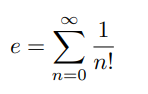
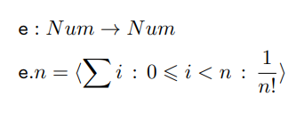

# NumeroEuler-calculadora

Su valor aproximado (truncado) es:
e ≈ 2, 71828182845904523536028747135266249775724709369995...
La forma mas comun de definir el valor de e es a traves de la siguiente serie infinita:



# Especificación



# Run

```bash
ghci main.hs
euler n

ghci> euler 5
2.716667 (aprox)


```
